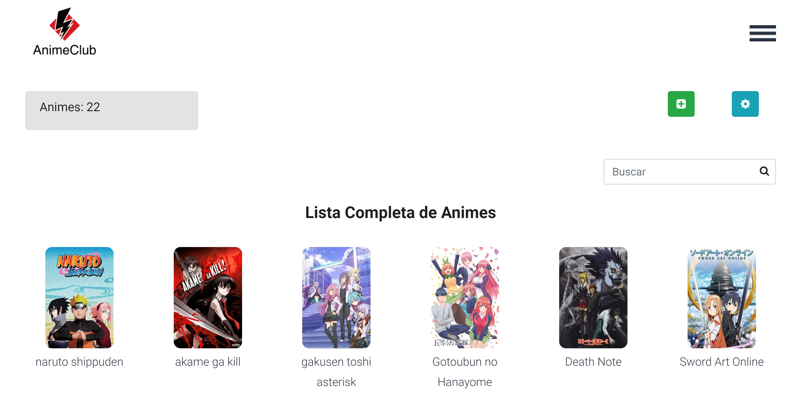
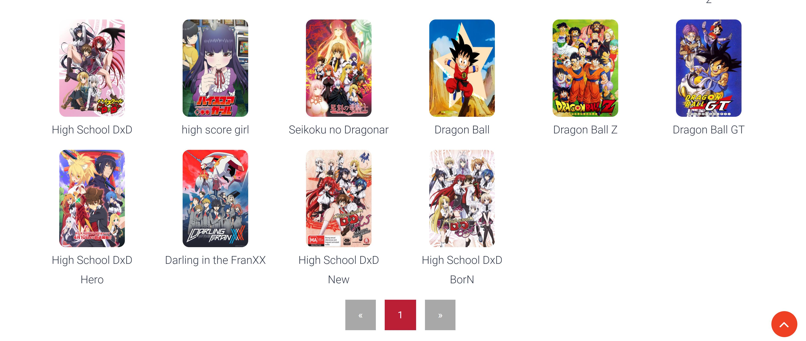
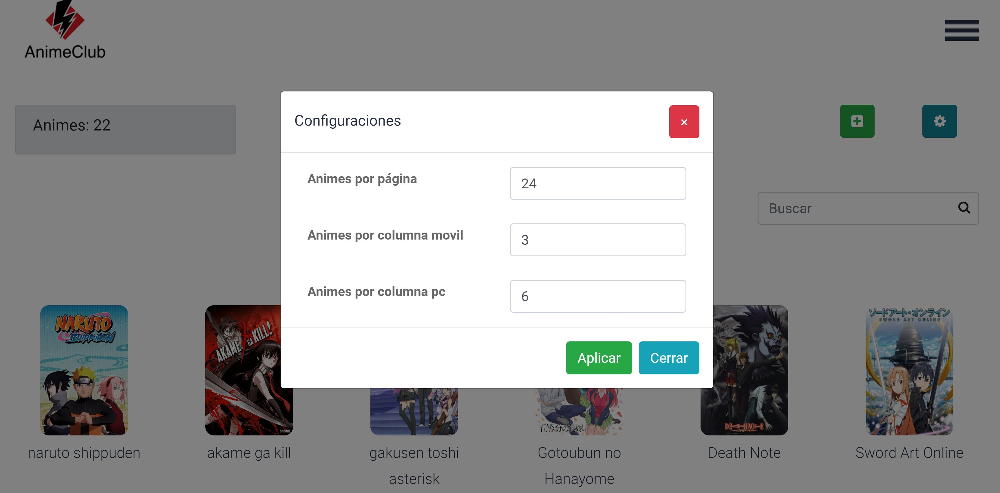
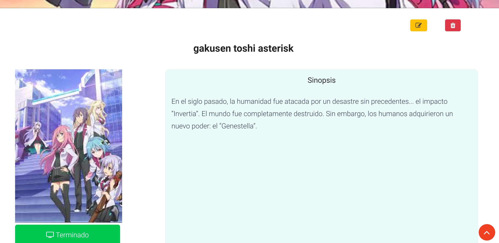
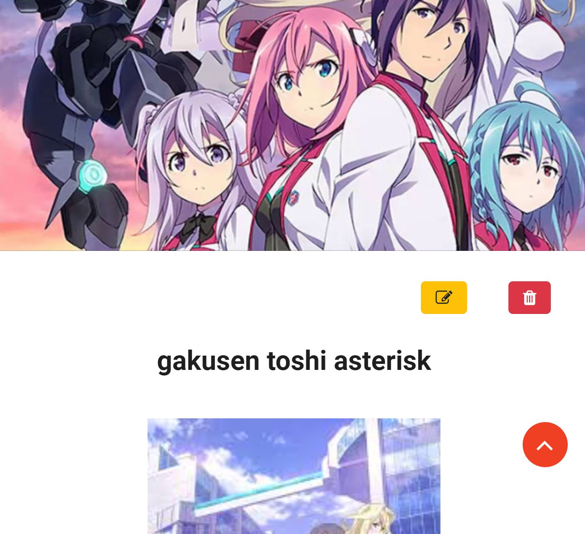
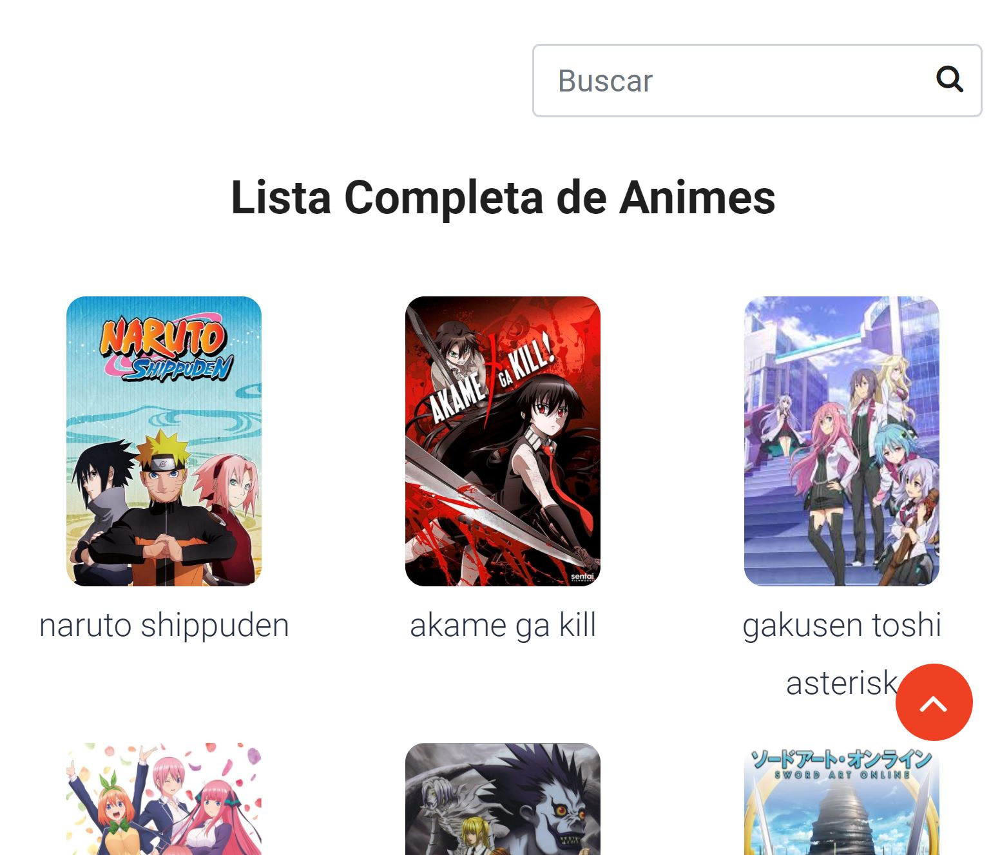

# AnimeClub

Página web de uso personal para guardar registros de un anime que ya terminó de ver, que está viendo actualmente o que tiene pendiente por ver.


## Demo ⛏️


https://animeclub1.herokuapp.com/

## Pre-requisitos 📋

- <a href="https://nodejs.org/">NodeJS</a>

- PHP 8.0.0

- MySQL 8.0.0

## Inicio rápido 🚀

1. Clone el repositorio `git clone https://github.com/Moisz22/AnimeClub.git`.

2. Vaya al directorio raiz del proyecto y ejecute el comando `npm install` para instalar las dependencias.

3. Cree la base de datos con el nombre **series_vistas** y a continuación importe el archivo **series_vistas.sql** que se encuentra en el directorio raiz del proyecto.

4. Vaya al archivo **config.php** que se encuentra en la ruta config/config.php y modifique el arreglo **bd_config** con sus credenciales de base de datos.
    ```
    $bd_config = array(
        'servidor'    => 'localhost',
        'servidor_db'    => 'mysql',
        'puerto'         => '3306',
        'basedatos'      => 'series_vistas',
        'usuario'        => 'root',
        'password'       =>  ''
    );
    ```
## Credenciales

- usuario: root

- password: 123456

## Licencia 📄

Este proyecto está bajo la Licencia (MIT) - mira el archivo  para detalles.

## Capturas del proyecto

#capturas en pantalla grande






#capturas en dispositivos móviles




Descargo de responsabilidad: todos los recursos artísticos utilizados son para fines educativos y de demostración. Todos los derechos de las imagenes están reservados a sus propietarios originales. Si usted (como persona o empresa) posee el arte y no desea que esté asociado con este proyecto, pongase en conctacto con la página de facebook https://www.facebook.com/AnimeClub-101357742004950 y con gusto lo retiro.